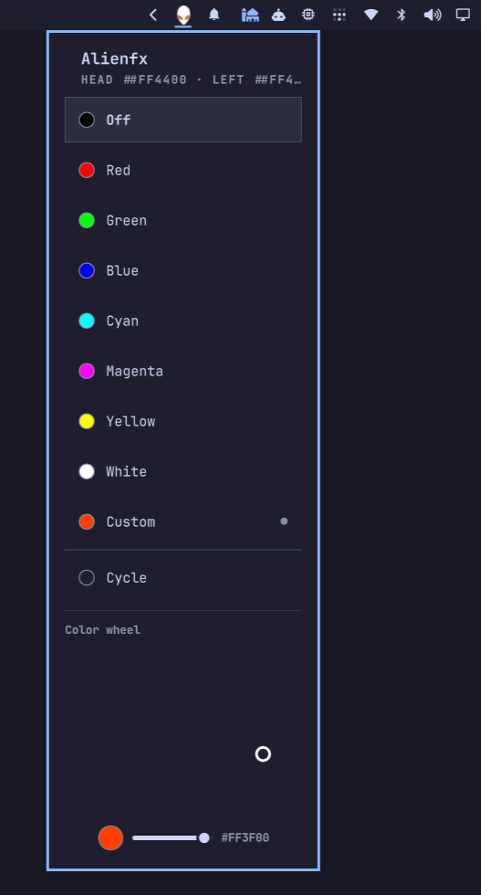

# Alienfx for Omarchy



Control the Alienware Alpha LED zones (head + left) straight from the Omarchy
bar. A headless background service wraps `alienware-cli`; a bar widget shows an
alien head whose eyes glow with the current zone colors and lets you pick a
preset or mix an exact color on a wheel.

## Requirements

- An Alienware Alpha (Alienware WMI driver loaded: `/sys/devices/platform/alienware-wmi`)
- The `alienware-cli` binary at `/usr/local/bin/alienware-cli`
- A udev rule so writes work without sudo:
  `/etc/udev/rules.d/90-alienware-rgb.rules` (chmods the sysfs controls to
  0666 on driver add). Without it, writes fail with "do you need sudo".

## Supported devices

The plugin drives the legacy `rgb_zones` sysfs interface of the mainline
`alienware-wmi` kernel driver. The models explicitly listed by the driver for
that interface are:

| Model                        | LED zones |
| ---------------------------- | --------- |
| Alienware ASM100 (Alpha)     | 2         |
| Alienware ASM200 (Alpha R2)  | 2         |
| Alienware ASM201 (Alpha R2)  | 2         |
| Alienware X51 R1             | 3         |
| Alienware X51 R2             | 3         |
| Alienware X51 R3             | 4         |
| Dell Inspiron 5675           | 2         |

Plus a generic fallback quirk (2 zones) for any unlisted machine that still
binds the legacy interface — but it is not guaranteed to work.

Newer Alienware/Dell machines (m16/m17/m18, x15/x17, and the Dell G3/G5/G15
series) are **not** supported: their `alienware-wmi` quirk sets `num_zones = 0`
and their RGB runs on a separate STM32 USB-HID controller (vendor `187c`),
which needs `alienfx-tools` rather than `alienware-cli`.

## Install

Install the plugin straight from its git repository (adds it to your plugins
folder, validates it, and enables it):

```bash
omarchy plugin add https://github.com/tariqbaater/alienfx.git --enable
omarchy-restart-shell
```

If you skipped `--enable`, or want to move the widget afterwards, use:

```bash
omarchy plugin enable tariq.alienfx right
```

`right` is the bar section — `left`, `center`, or `right` (the default). The
shell restart is required the first time so the widget is added to the bar —
`omarchy plugin enable` alone only syncs the background service.

To disable, update, or remove:

```bash
omarchy plugin disable tariq.alienfx
omarchy plugin update tariq.alienfx
omarchy plugin remove tariq.alienfx
```

## Use

- **left-click** the bar icon to cycle to the next preset
- **right-click** to open the picker: choose a preset, hit **Cycle**, or mix a
  custom color on the **Color wheel** (hue/saturation disc + brightness
  slider). The mixed color applies live while you drag and is saved when you
  release.
- **hovering** shows the active preset and both zone colors (`#rrggbb`)

The bar icon is an alien head drawn in the bar's foreground color (matching
stock Omarchy icons): the left eye glows the head zone color, the right eye the
left-zone color.

## Presets

The widget ships with a fixed preset list:

| Preset    | RGB (0–15) |
| --------- | ---------- |
| Off       | 0 0 0      |
| Red       | 15 0 0     |
| Green     | 0 15 0     |
| Blue      | 0 0 15     |
| Cyan      | 0 15 15    |
| Magenta   | 15 0 15    |
| Yellow    | 15 15 0    |
| White     | 15 15 15   |
| Custom    | wheel      |

The chosen preset (and the last wheel color) are stored inline in the bar
layout config (`~/.config/omarchy/shell.json`) and re-applied automatically on
the next shell start.

## Troubleshooting

- The widget looks dimmed → the service could not detect the LED unit. Check
  with `alienware-cli -jl`; it should return `{"leds":{"exists":true,...}}`.
- Writes report "do you need sudo" → the udev rule is missing or stale after a
  kernel/driver change. Re-apply it with
  `/tmp/opencode/setup-alienware-perms.sh` (`udevadm trigger --action=add`).
- The CLI returns exit code 0 even on failure, so the plugin scans command
  output for `"permission"` / `"do you need sudo"` / `"no alienware LED unit"`
  to detect errors.
